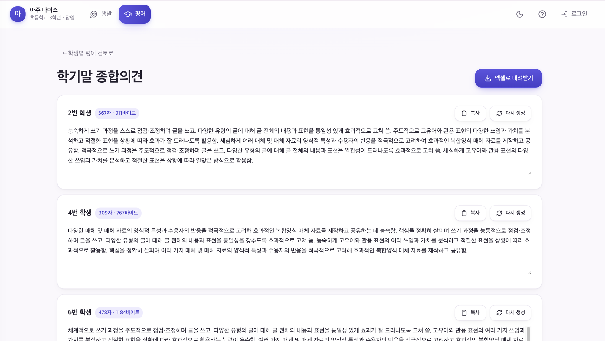

# 아주 나이스

> 교사가 2022 개정 교육과정 성취기준에 근거해 교과평어·과세특·행동특성 초안을 만들고, 최종 문장은 교사가 확인해 확정합니다.

[🌐 바로 사용하기](https://pyeonghaeng-toktok.web.app) [💻 소스코드](https://github.com/devtruelightn/dingdingding) [▶️ 시연 보기](https://youtu.be/xxxxxxxxxxx)

## 대표 화면과 링크




성취기준을 근거로 만든 학생별 초안을 교사가 검토하고, 글자 수·바이트를 확인한 뒤 엑셀로 내려받는 화면입니다.

## 최종적으로 해결한 문제

학기 말마다 교사는 학생 한 명 한 명의 교과평어(초등 평어 / 중·고등 과세특)와 행동특성 및 종합의견을 써야 합니다. 성취기준 문서를 따로 열어 근거를 찾고, 문장이 겹치지 않게 다듬고, 글자 수를 맞추는 데 많은 시간이 들어갑니다. 그렇다고 일반 AI 챗봇에 학생 이름과 관찰 기록을 그대로 붙여 넣으면 개인정보가 외부로 나갑니다.

### 어떻게 풀었나요?

성취기준 데이터(교육부 공개 성취수준 PDF에서 추출한 611건)를 앱 안에 넣어 두고, 교사가 고른 성취기준과 평가단계(A·B·C)를 근거로 초안을 만듭니다. 학생 실명은 브라우저(IndexedDB)에만 두고 AI로 보내지 않으며, 관찰 메모는 전송 전에 익명화 결과를 화면에서 확인할 수 있게 했습니다. 생성된 문장은 항상 초안 상태로 남고, 교사가 수정하고 '확인 완료'에 체크해야 내보낼 수 있습니다.

## 핵심 기능

- **성취기준 기반 평어 생성**: 학교급·학년·과목·영역·성취기준과 평가단계를 고르면 공식 A·B·C 수준 서술에 맞춘 초안을 만듭니다.
- **평가계획 파일 업로드**: 학교에서 쓰던 평가계획(엑셀·HWPX·PDF)을 올리면 성취기준을 뽑아 그대로 작업 목록으로 씁니다.
- **행동특성(행발) 작성**: 관찰 키워드와 실제로 본 특징만 입력하면 그 근거 안에서만 문장을 만듭니다. 입력하지 않은 역할·성취는 지어내지 않습니다.
- **개인정보 익명화**: 이름·이메일·전화번호·주민등록번호·학번 형태를 탐지해 치환하고, 전송될 내용을 미리 보여 줍니다.
- **중복·근거 점검**: 학생 간 문장 유사도를 검사해 겹치는 표현을 다시 만들고, 각 문장이 어떤 성취기준에 근거했는지 표시합니다.
- **학급 단위 작업과 이어쓰기**: 번호별 작업이 자동 저장되고, Google 로그인 시 다른 기기에서 이어서 작업할 수 있습니다.
- **내보내기**: 학생별 초안을 엑셀 워크북·CSV·텍스트로 내려받습니다.
- **삭제와 테마**: 로컬 실명, 클라우드 실명, 학년도 전체, 계정 전체를 골라 삭제할 수 있고 테마 8종(다크모드 포함)을 지원합니다.

## 사용 흐름과 사용 방법

1. 학교급(초·중·고)과 학년, 역할(담임 / 전담과목·교과)을 고른다
2. 성취기준을 직접 고르거나, 학교 평가계획 파일을 올려 불러온다
3. 학생별 평가단계(A·B·C)나 관찰 키워드·특징을 입력한다
4. 익명화된 전송 내용을 확인하고 초안을 생성한다
5. 근거와 중복 여부를 보며 문장을 수정하고 '확인 완료'에 체크한다
6. 엑셀·CSV로 내려받아 나이스에 옮겨 적는다

- 사용 환경: PC 웹(교사)
- 사용 조건: 저장·AI 생성은 Google 로그인 필요. 로그인 없이도 미리보기로 화면을 둘러볼 수 있습니다.

## 기술 스택과 실행 방법

- **화면**: Next.js 15(정적 내보내기), React 19, Tailwind CSS 4
- **서버·백엔드**: Firebase Cloud Functions(Node 22, TypeScript)
- **AI**: Upstage Solar (`solar-pro4`) — OpenAI 호환 API로 호출
- **저장소**: Firestore(작업 상태), Cloud Storage(업로드 원본), IndexedDB(학생 실명 — 기기 안에만)
- **파일 처리**: ExcelJS(엑셀), JSZip(HWPX), pdf.js(PDF) — 모두 브라우저에서 처리
- **배포**: Firebase Hosting + Cloud Functions

### 폴더 구조

```text
/src                        Next.js 앱
  app/                      라우트 진입점(layout, page), 전역 스타일
  components/               공용 UI(ui/), 레이아웃(layout/), 성취기준 선택(curriculum/)
  features/                 기능 단위 화면
    dashboard/              학교급·역할 선택 진입 화면
    subject-comments/       평어·과세특 생성(우리 반 / 빠른 생성)
    behavior-comments/      행동특성 생성, 관찰 키워드 선택
    assessment-plan/        평가계획 업로드·검토
    roster/ settings/ tutorial/
  lib/                      UI 없는 순수 로직
    curriculum/             성취기준 조회·평가단계
    files/                  엑셀·HWPX·PDF 추출과 매칭
    firebase/               인증·Firestore·Functions 호출
    text/                   문장 생성·유사도·형식 정리
    privacy.ts mask.ts      익명화와 화면 가리기
    local-db.ts             IndexedDB(학생 실명)
  data/                     curriculum.json(성취기준 611건), 추출 근거 리포트
/functions                  Cloud Functions
  src/index.ts              generateSubjectComment / generateBehaviorComment
  src/security.ts           인증·App Check·입력 검증·호출량 제한
  src/prompts/              학교급별 프롬프트 팩(.md)과 빌드 산출물
/tests                      unit / e2e(Playwright) / emulator(보안 규칙) / ai(계약)
```

### 설치와 실행

```bash
npm install && npm --prefix functions install
npm run dev
```

에뮬레이터까지 포함한 전체 로컬 실행은 `npm run dev:local` 입니다. 자세한 설정은 [CONTRIBUTING.md](CONTRIBUTING.md), 배포는 [DEPLOYMENT_GUIDE.md](DEPLOYMENT_GUIDE.md)를 참고하세요.

- 필요한 환경변수(이름만)
  - 프런트(`.env.local`): NEXT_PUBLIC_FIREBASE_API_KEY, NEXT_PUBLIC_FIREBASE_AUTH_DOMAIN, NEXT_PUBLIC_FIREBASE_PROJECT_ID, NEXT_PUBLIC_FIREBASE_STORAGE_BUCKET, NEXT_PUBLIC_FIREBASE_MESSAGING_SENDER_ID, NEXT_PUBLIC_FIREBASE_APP_ID, NEXT_PUBLIC_ENABLE_CLOUD_AI, NEXT_PUBLIC_USE_FIREBASE_EMULATOR, NEXT_PUBLIC_FIREBASE_APP_CHECK_SITE_KEY
  - 서버(`functions/.env.local`): UPSTAGE_API_KEY, UPSTAGE_MODEL, ENFORCE_APP_CHECK, APP_ORIGINS

## 작동 범위와 한계, 다음 계획

- 지금까지 확인한 범위: 초등 1~6학년 성취기준 611건으로 평어·행발 생성 확인, 유닛/E2E/보안규칙 테스트 통과

### 기술적 한계

- 성취기준 데이터는 초등(1~2 / 3~4 / 5~6학년군)만 들어 있어, 중·고등은 평가계획 파일을 올려야 성취기준을 쓸 수 있습니다
- 업로드 파일 서식이 학교마다 달라 성취기준 추출이 빗나갈 때가 있고, 이때는 교사가 검토 화면에서 고쳐야 합니다
- 익명화는 패턴 기반이라 별명이나 드문 표기는 놓칠 수 있습니다
- AI 호출은 사용자당 분 8회 / 일 250회로 제한되어 학급 전체를 한 번에 돌리면 나눠서 실행해야 합니다
- 개인정보 안내문이 아직 초안 상태이며 실제 운영 주체·보유 기간이 확정되지 않았습니다

### 다음 계획

- 중·고등 성취기준 데이터를 추가해 파일 업로드 없이도 쓸 수 있게 할 예정입니다
- 학교별 평가계획 서식을 더 모아 추출 정확도를 높이려 합니다
- 문장 중복 검사 기준을 학년·과목별로 조정할 예정입니다

## 교육 현장에서 사용할 때의 주의사항

- **개인정보 처리 여부**: 처리함(학생 이름·관찰 기록). 단, 이름은 기기 안에만 저장하고 AI로 보내지 않습니다.
- **예상되는 위험**: AI가 관찰 근거에 없는 성취나 태도를 지어낸 문장이 그대로 생활기록부에 옮겨질 수 있습니다.
- **위험을 줄이려고 한 일**: 입력한 근거 안에서만 문장을 만들도록 프롬프트를 제한하고, 근거가 된 성취기준을 문장마다 표시하며, '확인 완료' 체크 전에는 내보내기를 막았습니다.
- **멈춤 기준**: 근거에 없는 내용이 섞인 문장이 눈에 띄게 늘면 AI 생성을 끄고(`NEXT_PUBLIC_ENABLE_CLOUD_AI=false`) 수기 작성으로 돌립니다.
- **검증 방법**: 실제 성취기준·평가단계 조합으로 문장을 생성해 근거 대조와 중복 검사를 사람이 확인했고, AI 응답 형식은 계약 테스트(`tests/ai`)로 검증합니다.

### 입력·전송·저장 정보

- 학생 이름 — 교사가 명단을 등록할 때 입력 — 전송하지 않음(현재 기기 IndexedDB에만 저장, 사용자가 직접 켠 경우에만 본인 비공개 경로에 저장)
- 학생 번호·무작위 학생 ID·평가단계·생성 문장 — 작업 중 생성 — Firestore(사용자 본인 경로)에 저장
- 관찰 메모 — 교사가 입력 — 익명화 후 Cloud Functions를 거쳐 Upstage Solar API로 전송
- 평가계획·평가결과 파일 — 교사가 업로드 — 브라우저에서 추출하며 원본은 기본적으로 저장하지 않음

### 교육적 태도 점검

- 평가·추천·피드백을 프로그램이 대신 확정하지 않게 했나요?: 네 (생성 결과는 항상 초안이며, 교사가 수정하고 '확인 완료'에 체크해야 내보낼 수 있습니다.)
- 학생이나 교사의 생각을 대신하지 않게 했나요?: 점검하다 고쳤어요 (처음엔 관찰 메모가 비어도 문장이 나왔는데, 입력한 근거 안에서만 쓰도록 제한했습니다.)
- 저장·전달·제출 전에 사람이 확인할 수 있나요?: 네 (AI로 보낼 익명화 결과를 전송 전에 화면에서 보여 주고, 내보내기 전에 초안을 검토합니다.)
- 기기·계정·조작 문제로 참여에서 빠지는 사람이 없게 했나요?: 점검하다 고쳤어요 (로그인해야만 쓸 수 있던 구조에서, 로그인 없이 둘러볼 수 있는 미리보기 모드를 넣었습니다.)

## 제작자와 라이선스

- (이름) · (소속) · (역할)
- **코드 라이선스**: MIT — [LICENSE](LICENSE)
- **문서 라이선스**: CC BY 4.0 — [LICENSE-docs](LICENSE-docs)
- **외부 자료 출처**
  - 성취기준 데이터: 교육부 「2022 개정 교육과정에 따른 성취수준」 공개 PDF(초등 1~2 / 3~4 / 5~6학년군)에서 추출 — 추출 근거와 원본 SHA-256은 `src/data/curriculum-report.json`
  - 아이콘: Lucide (ISC)
  - 폰트: Pretendard (SIL OFL 1.1)
  - 라이브러리: Next.js·React·ExcelJS·JSZip·Zod (MIT), pdf.js·Firebase SDK (Apache-2.0), idb (ISC)

## 교사 개발자 윤리 자가점검

- 응답 인원: (N)명 / 팀원 (N)명

| 원칙 | 평균 점수 |
| --- | --- |
| 학생 성장 최우선 |  / 5.0 |
| 개인정보·데이터 보호 |  / 5.0 |
| 책임과 출처 존중 |  / 5.0 |
| 안전한 실험과 검증 |  / 5.0 |
| 역할 경계 인식 |  / 5.0 |
| 공공성 |  / 5.0 |
| 투명성 및 설명 가능성 |  / 5.0 |
| **전체 평균** | **  / 5.0** |

### 우리가 더한 약속

- (이름): (약속)
